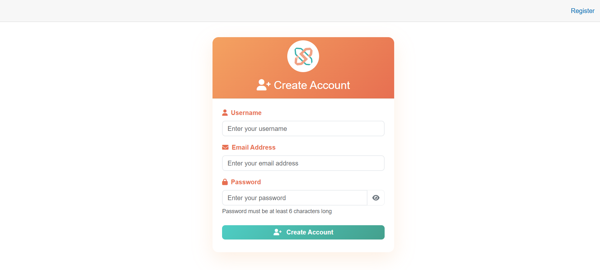

# User Registration Using Blazor and ASP.NET Core with Entity Framework

### Secure user registration application built with ASP.NET Core Blazor Server and ASP.NET Core Identity.

### Technology Srack
#### Backend: ASP.NET Core 9.0
#### Frontend: Blazor Server Compnent
#### Database: SQLite with Entity Framework Core
#### Authentication: ASP.NET Core Identity



# Clone and Run the Project

## 1. Clone the Repository
```bash
git clone https://github.com/Nipuni-De-Silva/UserRegistrationApp.git
```

```bash
cd UserRegistrationApp
```

## 2. Restore Dependencies
```bash
dotnet restore
```

## 3. Setup Database
```bash
dotnet ef migrations add InitialCreate
```

```bash
dotnet ef database update
```

## 4. Run the Application
```bash
dotnet run
```

#### application will be available at: http://localhost:5171


## API Endpoints

```bash
curl -X POST http://localhost:5171/api/user/register -H "Content-Type: application/json" -d '{"username":"testuser","email":"test@example.com","password":"Test@123"}'
```

# Contributing

## 1. Fork and Clone

```bash
git clone https://github.com/Nipuni-De-Silva/UserRegistrationApp.git
```

```bash
cd UserRegistrationApp
```

## 2. Create a Feature Branch

```bash
git checkout -b feature/your-branch-name
```

## 3. Make Changes

## 4. Commit Changes

```bash
git add .
```

```bash
git commit -m "Add Commit Message"
```

## 5. Push and Create Pull Request

```bash
git push origin feature/your-branch-name
```
